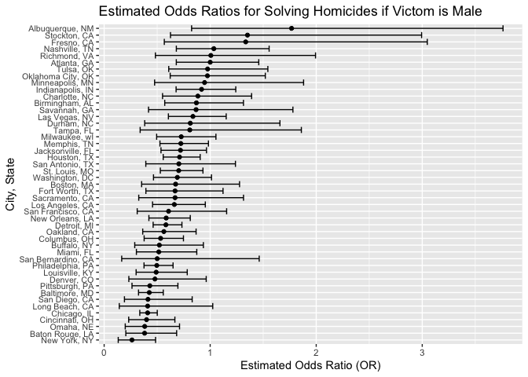
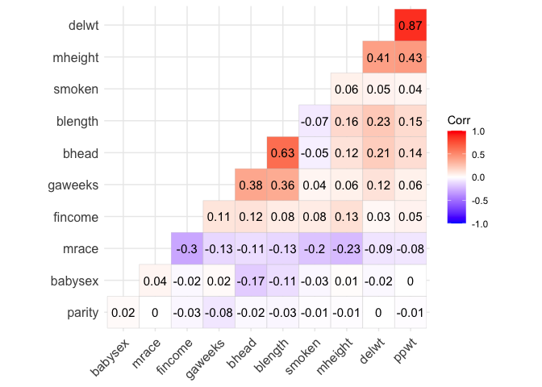
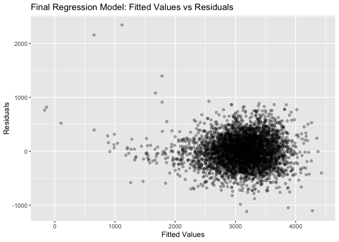
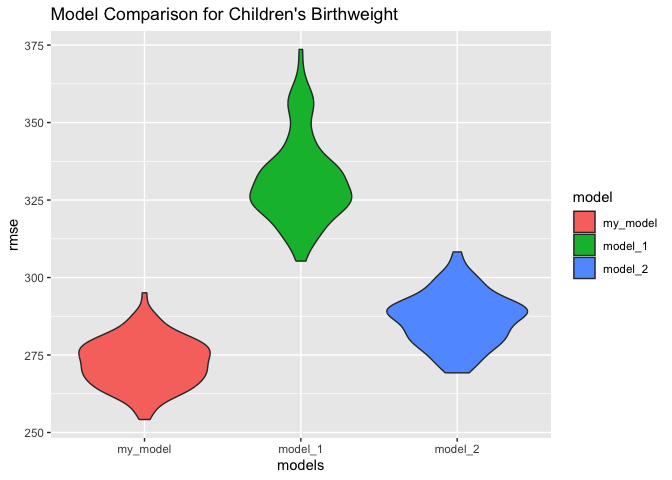

p8105_hw6_bk2959
================
Stella Koo
2024-11-16

## Problem 1

``` r
library(tidyverse)

weather_df = 
  rnoaa::meteo_pull_monitors(
    c("USW00094728"),
    var = c("PRCP", "TMIN", "TMAX"), 
    date_min = "2017-01-01",
    date_max = "2017-12-31") |>
  mutate(
    name = recode(id, USW00094728 = "CentralPark_NY"),
    tmin = tmin / 10,
    tmax = tmax / 10) |>
  select(name, id, everything())
```

## Problem 2

### Data Cleaning

``` r
homicide_df = read_csv("homicide.csv") |>
  janitor::clean_names() |>
  mutate(city_state = str_c(city, state, sep = ", "),
         solved = ifelse(disposition == "Closed by arrest", 1, 0), 
         victim_age = as.numeric(victim_age)) |>
  filter(!city_state %in% c("Dallas, TX", "Phoenix, AZ", "Kansas City, MO", "Tulsa, AL"),
         victim_race %in% c("White", "Black")) 
```

### Baltimore, MD

The following presents the results of a logistic regression analysis
conducted in Baltimore, MD, with resolved vs unresolved as the outcome
variable. The predictors in the model include victim age, sex, and race.
The table summarizes the estimated effects of each predictor on the
outcome.

``` r
baltimore_fit = homicide_df |>
  filter(city_state == "Baltimore, MD") |>
  glm(solved ~ victim_age + victim_sex + victim_race, data = _, family = binomial)

knitr::kable(broom::tidy(baltimore_fit), digits = 3)
```

| term             | estimate | std.error | statistic | p.value |
|:-----------------|---------:|----------:|----------:|--------:|
| (Intercept)      |    0.310 |     0.171 |     1.810 |   0.070 |
| victim_age       |   -0.007 |     0.003 |    -2.024 |   0.043 |
| victim_sexMale   |   -0.854 |     0.138 |    -6.184 |   0.000 |
| victim_raceWhite |    0.842 |     0.175 |     4.818 |   0.000 |

The following shows the estimate and confidence interval for the
adjusted odds ratio (OR) comparing male victims to female victims for
solving homicides, while holding all other variables constant:

``` r
adjusted_or = baltimore_fit |>
  broom::tidy(conf.int = TRUE) |>
  mutate(odds_ratio = exp(estimate),
    conf_low = exp(conf.low),
    conf_high = exp(conf.high)) |> 
  filter(term == "victim_sexMale") |>
  select(odds_ratio, conf_low, conf_high)

knitr::kable(adjusted_or, digits = 3)
```

| odds_ratio | conf_low | conf_high |
|-----------:|---------:|----------:|
|      0.426 |    0.324 |     0.558 |

### All Cities

The adjusted odds ratio and confidence interval for solving homicides,
comparing male victims to female victims, were calculated for each city
in the dataset.

``` r
model_or_ci = function(city_data){
  
  fit = glm(solved ~ victim_age + victim_sex + victim_race, data = city_data, family = binomial) |>
    broom::tidy(conf.int = TRUE, exponentiate = TRUE) |>
    filter(term == "victim_sexMale") |>
    select(odds_ratio = estimate, conf.low, conf.high)
  
}

cities_fit = homicide_df |>
  group_by(city_state) |>
  nest() |>
  mutate(results = map(data, model_or_ci)) |>
  unnest(results) |>
  select(-data)

cities_fit_results = cities_fit |>
  head(5) |>
  knitr::kable(digits = 3)

cities_fit_results
```

| city_state      | odds_ratio | conf.low | conf.high |
|:----------------|-----------:|---------:|----------:|
| Albuquerque, NM |      1.767 |    0.825 |     3.762 |
| Atlanta, GA     |      1.000 |    0.680 |     1.458 |
| Baltimore, MD   |      0.426 |    0.324 |     0.558 |
| Baton Rouge, LA |      0.381 |    0.204 |     0.684 |
| Birmingham, AL  |      0.870 |    0.571 |     1.314 |

``` r
ggplot(cities_fit, aes(x = reorder(city_state, odds_ratio), 
                       y = odds_ratio, 
                       ymin = conf.low, 
                       ymax = conf.high)) +
  geom_point() +
  coord_flip() +
  geom_errorbar(aes(ymin = conf.low, ymax = conf.high)) +
  labs(x = "City, State",
    y = "Estimated Odds Ratio (OR)",
    title = "Estimated Odds Ratios for Solving Homicides if Victom is Male") +  
  theme(axis.text.y = element_text(size = 8))
```

<!-- -->

The top three cities with the highest odds ratios (OR) for solving
homicides—Minneapolis, MN, Stockton, CA, and Fresno, CA—all exhibit OR
values greater than 1. Minneapolis, MN has the highest odds ratio,
indicating that homicides involving male victims are more likely to be
solved compared to those involving female victims in these cities.
However, the confidence intervals for these cities are wide, with the
lower bounds extending below 1. This indicates significant statistical
uncertainty. As a result, while the trend suggests an advantage for male
victims in solving homicides, these findings should be interpreted with
caution due to a lack of precision.

In contrast, cities such as New York, NY, Baton Rouge, LA, and Omaha, NE
exhibit odds ratios closer to 0, with New York, NY having the lowest
value. This indicates that the odds of solving homicides are
significantly lower for male victims compared to female victims in these
cities. Unlike the first group, the confidence intervals here are
narrower and remain below 1, suggesting that these results are
statistically robust and consistent.

## Problem 3

### Data Cleaning

The dataset was cleaned for regression analysis. Numeric variables were
converted to factors where appropriate.

``` r
birthweight_df = read_csv("birthweight.csv") |>
  janitor::clean_names() |>
  mutate(
    babysex = factor(babysex, labels = c("male", "female")),
    frace = factor(frace, 
                   levels = c(1, 2, 3, 4, 8, 9), 
                   labels = c("white", "black", "asian", "puerto rican", "other", "unknown")),
    malform = factor(malform, labels = c("absent", "present")),
    mrace = factor(mrace, 
                   levels = c(1, 2, 3, 4, 8), 
                   labels = c("white", "black", "asian", "puerto rican", "other"))
    )
```

``` r
sum(is.na(birthweight_df))
```

    ## [1] 0

The dataset was checked for any missing values and none were found.

### Regression Model for birthweight (`bwt`)

1.  I began by fitting the model using all available variables to assess
    the factors influencing birth weight. The following table shows the
    summary of the first five predictors.

``` r
full_model = lm(bwt ~ ., data = birthweight_df)

full_model_summary = full_model |>
  broom::tidy() |>
  head(5) |>
  knitr::kable(digits = 3)

full_model_summary
```

| term          |  estimate | std.error | statistic | p.value |
|:--------------|----------:|----------:|----------:|--------:|
| (Intercept)   | -6265.391 |   660.401 |    -9.487 |   0.000 |
| babysexfemale |    28.707 |     8.465 |     3.391 |   0.001 |
| bhead         |   130.778 |     3.452 |    37.881 |   0.000 |
| blength       |    74.954 |     2.022 |    37.075 |   0.000 |
| delwt         |     4.101 |     0.395 |    10.386 |   0.000 |

2.  Next, I employed stepwise model selection to identify a subset of
    variables that best explain the variation in birth weight. The
    selected predictors are: `babysex`, `bhead`, `blength`, `delwt`,
    `fincome`, `gaweeks`, `mheight`, `mrace`, `parity`, `ppwt`, and
    `smoken`.

``` r
stepwise_model = MASS::stepAIC(full_model, direction = "both", trace = FALSE) 

stepwise_model_summary = broom::tidy(stepwise_model) |> 
  knitr::kable(digits = 3)

stepwise_model_summary
```

| term              |  estimate | std.error | statistic | p.value |
|:------------------|----------:|----------:|----------:|--------:|
| (Intercept)       | -6098.822 |   137.546 |   -44.340 |   0.000 |
| babysexfemale     |    28.558 |     8.455 |     3.378 |   0.001 |
| bhead             |   130.777 |     3.447 |    37.944 |   0.000 |
| blength           |    74.947 |     2.019 |    37.120 |   0.000 |
| delwt             |     4.107 |     0.392 |    10.475 |   0.000 |
| fincome           |     0.318 |     0.175 |     1.820 |   0.069 |
| gaweeks           |    11.592 |     1.462 |     7.929 |   0.000 |
| mheight           |     6.594 |     1.785 |     3.694 |   0.000 |
| mraceblack        |  -138.792 |     9.907 |   -14.009 |   0.000 |
| mraceasian        |   -74.887 |    42.315 |    -1.770 |   0.077 |
| mracepuerto rican |  -100.678 |    19.325 |    -5.210 |   0.000 |
| parity            |    96.305 |    40.336 |     2.388 |   0.017 |
| ppwt              |    -2.676 |     0.427 |    -6.261 |   0.000 |
| smoken            |    -4.843 |     0.586 |    -8.271 |   0.000 |

3.  To mitigate potential multicollinearity among the predictors, I
    calculated the correlation coefficients to ensure that the selected
    variables were not highly correlated with one another.

The correlation matrix revealed that `ppwt` was strongly correlated with
`delwt` (r = 0.87), indicating potential multicollinearity. To reduce
redundancy and improve the model’s reliability, I removed `ppwt` from
the analysis.

``` r
selected_vars = birthweight_df[c("babysex", "bhead", "blength", "delwt", "fincome", 
                                  "gaweeks", "mheight", "mrace", "parity", "ppwt", "smoken")]

selected_vars$babysex = as.numeric(selected_vars$babysex)
selected_vars$mrace = as.numeric(selected_vars$mrace)

correlation_matrix = cor(selected_vars)

library(ggcorrplot)
ggcorrplot(correlation_matrix, hc.order = TRUE, type = "lower", lab = TRUE)
```

<!-- -->

My final model for predicting birthweight (`bwt`) consists of the
following predictors: `babysex`, `blength`, `bhead`, `delwt`, `fincome`,
`gaweeks`, `mheight`, `mrace`, `parity`, and `smoken`.

### Plot of model residuals against fitted values

``` r
final_model = birthweight_df |>
  lm(bwt ~ babysex + blength + bhead +  delwt + fincome + gaweeks + mheight + mrace + parity + smoken, data = _)

final_model_results = birthweight_df |> 
  modelr::add_residuals(final_model) |> 
  modelr::add_predictions(final_model)

final_model_plot = ggplot(final_model_results, aes(x = pred, y = resid)) +
  geom_point(alpha = 0.3) +
  labs( x = "Fitted Values",
        y = "Residuals",
        title = "Final Regression Model: Fitted Values vs Residuals")

final_model_plot
```

<!-- -->
The plot of fitted values versus residuals shows that most residuals are
centered around zero, suggesting that the regression model is
appropriate. This indicates that the model is well-fitted to the data.

### Comparing Models

``` r
library(modelr)
library(mgcv)
set.seed(1)

cv_df =
  crossv_mc(birthweight_df, 100) |>
  mutate(train = map(train, as_tibble),
    test = map(test, as_tibble))

my_model = lm(bwt ~ babysex + blength + bhead + delwt + fincome + gaweeks + mheight + mrace + parity + smoken, data = birthweight_df)
model_1 = lm(bwt ~ blength + gaweeks, data = birthweight_df)
model_2 = lm(bwt ~ bhead * blength * babysex, data = birthweight_df)

cv_df = cv_df |>
  mutate(
    my_model = map(train, \(df) lm(bwt ~ babysex + blength + bhead + delwt + fincome + gaweeks + mheight + mrace + parity + smoken, data = birthweight_df)),
    model_1 = map(train, \(df) lm(bwt ~ blength + gaweeks, data = birthweight_df)),
    model_2 = map(train, \(df) lm(bwt ~ bhead * blength * babysex, data = birthweight_df))
    ) |>
  mutate(
    rmse_my_model = map2_dbl(my_model, test, \(mod, df) rmse(model = mod, data = df)),
    rmse_model_1 = map2_dbl(model_1, test, \(mod, df) rmse(model = mod, data = df)),
    rmse_model_2 = map2_dbl(model_2, test, \(mod, df) rmse(model = mod, data = df))
    )

comparison_plot = cv_df |>
  select(starts_with("rmse")) |>
  pivot_longer(
        everything(),
    names_to = "model", 
    values_to = "rmse",
    names_prefix = "rmse_") |> 
  mutate(model = fct_inorder(model)) |> 
  ggplot(aes(x = model, y = rmse)) + 
  geom_violin(aes(fill = model)) +
  labs(x = "models",
       y = "rmse",
       title = "Model Comparison for Children's Birthweight")

comparison_plot
```

<!-- -->

The violin plot shows that my model has the lowest RMSE, followed by
model 2, with model 1 exhibiting the highest RMSE. This suggests that my
model provides the best fit for predicting children’s birthweight,
indicating its suitability for regression modeling in this context.
