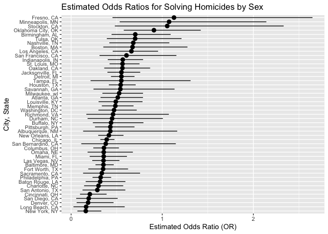

p8105_hw6_bk2959
================
Stella Koo
2024-11-16

## Problem 2

### Data Cleaning

``` r
library(tidyverse)

homicide_df = read_csv("homicide.csv") |>
  janitor::clean_names() |>
  mutate(city_state = str_c(city, state, sep = ", "),
         solved = ifelse(disposition == "Closed by arrest", 1, 0), 
         victim_age = as.numeric(victim_age)) |>
  filter(!city_state %in% c("Dallas, TX", "Phoenix, AZ", "Kansas City, MO", "Tulsa, AL"),
         victim_race %in% c("White", "Black")) 
```

### Baltimore, MD

The following presents the results of a logistic regression analysis
conducted in Baltimore, MD, with resolved vs unresolved as the outcome
variable. The predictors in the model include victim age, sex, and race.
The table summarizes the estimated effects of each predictor on the
outcome.

``` r
baltimore_fit = homicide_df |>
  filter(city_state == "Baltimore, MD") |>
  glm(solved ~ victim_age + victim_sex + victim_race, data = _, family = binomial)

knitr::kable(broom::tidy(baltimore_fit), digits = 3)
```

| term             | estimate | std.error | statistic | p.value |
|:-----------------|---------:|----------:|----------:|--------:|
| (Intercept)      |    0.310 |     0.171 |     1.810 |   0.070 |
| victim_age       |   -0.007 |     0.003 |    -2.024 |   0.043 |
| victim_sexMale   |   -0.854 |     0.138 |    -6.184 |   0.000 |
| victim_raceWhite |    0.842 |     0.175 |     4.818 |   0.000 |

The following shows the estimate and confidence interval for the
adjusted odds ratio (OR) comparing male victims to female victims for
solving homicides, while holding all other variables constant:

``` r
adjusted_or = baltimore_fit |>
  broom::tidy(conf.int = TRUE) |>
  mutate(odds_ratio = exp(estimate),
    conf_low = exp(conf.low),
    conf_high = exp(conf.high)) |> 
  filter(term == "victim_sexMale") |>
  select(odds_ratio, conf_low, conf_high)

knitr::kable(adjusted_or, digits = 3)
```

| odds_ratio | conf_low | conf_high |
|-----------:|---------:|----------:|
|      0.426 |    0.324 |     0.558 |

### All Cities

The adjusted odds ratio and confidence interval for solving homicides,
comparing male victims to female victims, were calculated for each city
in the dataset.

``` r
model_or_ci = function(city_data){
  
  fit = glm(solved ~ victim_age + victim_sex + victim_race, data = city_data, family = binomial) |>
    broom::tidy(conf.int = TRUE, exponentiate = TRUE) |>
    filter(term == "victim_sexMale") |>
    select(odds_ratio = estimate, conf.low, conf.high)
  
}

cities_fit = homicide_df |>
  group_by(city_state) |>
  nest() |>
  mutate(results = map(data, model_or_ci)) |>
  unnest(results) |>
  select(-data)

cities_fit_results = cities_fit |>
  head(5) |>
  knitr::kable(digits = 3)

cities_fit_results
```

| city_state      | odds_ratio | conf.low | conf.high |
|:----------------|-----------:|---------:|----------:|
| Albuquerque, NM |      1.767 |    0.825 |     3.762 |
| Atlanta, GA     |      1.000 |    0.680 |     1.458 |
| Baltimore, MD   |      0.426 |    0.324 |     0.558 |
| Baton Rouge, LA |      0.381 |    0.204 |     0.684 |
| Birmingham, AL  |      0.870 |    0.571 |     1.314 |

``` r
ggplot(cities_fit, aes(x = reorder(city_state, odds_ratio), 
                       y = odds_ratio, 
                       ymin = conf.low, 
                       ymax = conf.high)) +
  geom_point() +
  coord_flip() +
  geom_errorbar(aes(ymin = conf.low, ymax = conf.high)) +
  labs(x = "City, State",
    y = "Estimated Odds Ratio (OR)",
    title = "Estimated Odds Ratios for Solving Homicides if Victom is Male") +  
  theme(axis.text.y = element_text(size = 8))
```

<!-- --> The
top three cities with the highest odds ratios (OR) for solving
homicides—Minneapolis, MN, Stockton, CA, and Fresno, CA—all exhibit OR
values greater than 1. Minneapolis, MN has the highest odds ratio,
indicating that homicides involving male victims are more likely to be
solved compared to those involving female victims in these cities.
However, the confidence intervals for these cities are wide, with the
lower bounds extending below 1. This indicates significant statistical
uncertainty. As a result, while the trend suggests an advantage for male
victims in solving homicides, these findings should be interpreted with
caution due to a lack of precision.

In contrast, cities such as New York, NY, Long Beach, CA, and Denver, CO
exhibit odds ratios closer to 0, with New York, NY having the lowest
value. This indicates that the odds of solving homicides are
significantly lower for male victims compared to female victims in these
cities. Unlike the first group, the confidence intervals here are
narrower and remain below 1, suggesting that these results are
statistically robust and consistent.

## Problem 3

### Data Cleaning
